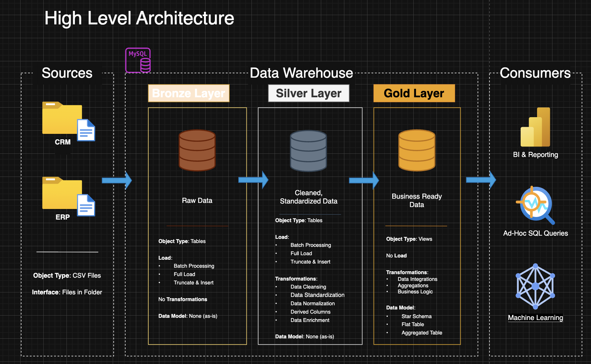
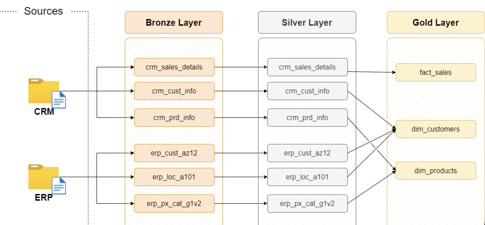
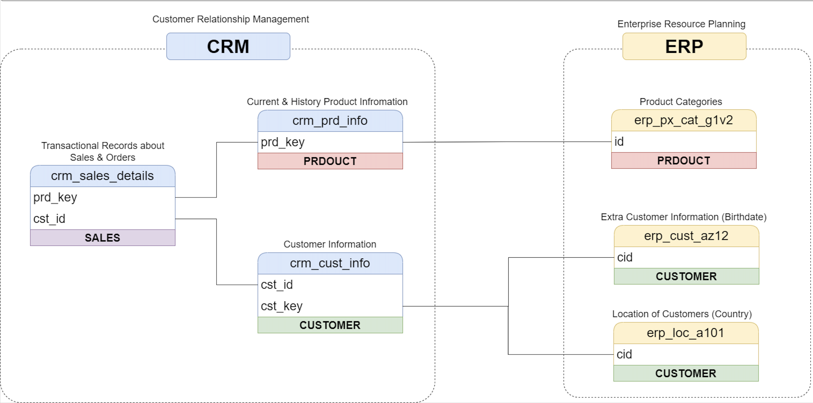
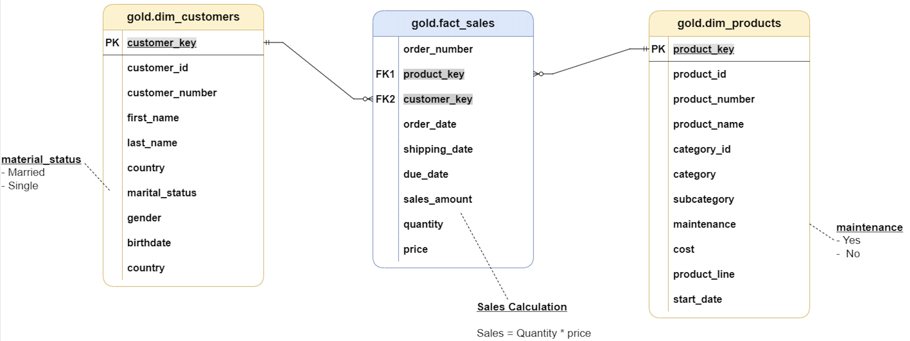

# SQL Data Warehouse Project

A modern data warehouse built from scratch using **MySQL**, implementing a full ETL pipeline with the **Medallion Architecture** (Bronze → Silver → Gold). This project demonstrates end-to-end data engineering skills including data modeling, transformation logic, and warehouse design.

---

## Project Overview

This project simulates a real-world scenario where data from a **CRM** system and an **ERP** system is ingested, cleansed, integrated, and modeled into a star schema for analytics and reporting.

### Key Highlights

- **Medallion Architecture** with Bronze (raw), Silver (cleansed), and Gold (business-ready) layers
- **Star Schema** data model with dimension and fact tables
- **Stored procedures** for repeatable ETL with error handling and load tracking
- **Data quality checks** at the Silver and Gold layers

---

## Architecture



**Sources → Data Warehouse → Consumers**

| Layer | Object Type | Load Method | Transformations |
|-------|-------------|-------------|-----------------|
| Bronze | Tables | Batch / Full Load / Truncate & Insert | None (raw as-is) |
| Silver | Tables | Batch / Full Load / Truncate & Insert | Cleansing, standardization, normalization, derived columns |
| Gold | Views | No load needed | Data integration, business logic, aggregation |

---

## Data Flow



### Source Systems

| Source | Tables | Description |
|--------|--------|-------------|
| CRM | `cust_info`, `prd_info`, `sales_details` | Customer, product, and sales transaction data |
| ERP | `CUST_AZ12`, `LOC_A101`, `PX_CAT_G1V2` | Customer demographics, location, and product categories |

### Data Integration



CRM and ERP data are joined in the Gold layer to produce enriched dimension tables. The CRM system serves as the primary source for customer and product identity, while ERP supplements with demographics (birthdate, gender), geography (country), and product categorization.

---

## Data Model



The Gold layer implements a **star schema** with:

- **`gold__dim_customers`** — Customer dimension enriched with CRM + ERP attributes
- **`gold__dim_products`** — Product dimension with category hierarchy and product line details
- **`gold__fact_sales`** — Sales fact table with order, shipping, and revenue metrics

**Sales Calculation:** `sales_amount = quantity × price`

---

## Repository Structure

```
sql-data-warehouse/
│
├── datasets/
│   ├── source_crm/              # CRM source CSV files
│   │   ├── cust_info.csv
│   │   ├── prd_info.csv
│   │   └── sales_details.csv
│   └── source_erp/              # ERP source CSV files
│       ├── CUST_AZ12.csv
│       ├── LOC_A101.csv
│       └── PX_CAT_G1V2.csv
│
├── docs/                        # Architecture and model diagrams
│   ├── Data_Architecture.png
│   ├── Data_Flow.png
│   ├── Data_Integration.png
│   ├── Data_Model.png
│   └── data_catalog.md          # Gold layer data dictionary
│
├── scripts/
│   ├── setup/
│   │   └── init_database.sql    # Creates the datawarehouse database
│   ├── bronze/
│   │   ├── ddl_bronze.sql       # Bronze table definitions
│   │   └── load_bronze.sql      # CSV ingestion into Bronze
│   ├── silver/
│   │   ├── ddl_silver.sql       # Silver table definitions
│   │   └── proc_load_silver.sql # Stored procedure: Bronze → Silver ETL
│   └── gold/
│       └── ddl_gold.sql         # Gold views (star schema)
│
├── tests/
│   ├── quality_checks_silver.sql
│   └── quality_checks_gold.sql
│
├── LICENSE
└── README.md
```

## ETL Transformations

### Bronze → Silver (Cleansing & Standardization)

| Table | Transformations Applied |
|-------|------------------------|
| `crm_cust_info` | Deduplicate by `cst_id` (keep latest), trim names, expand marital status codes (`S` → `Single`), expand gender codes (`F` → `Female`), handle null dates |
| `crm_prd_info` | Extract `cat_id` from composite `prd_key`, expand product line codes (`M` → `Mountain`), derive `prd_end_dt` using lead window function, default null costs to 0 |
| `crm_sales_details` | Convert integer dates (`YYYYMMDD`) to `DATE` type, correct negative prices, recalculate sales when inconsistent with `quantity × price` |
| `erp_cust_az12` | Strip `NAS` prefix from customer IDs, filter future birthdates, standardize gender values |
| `erp_loc_a101` | Remove dashes from customer IDs, expand country codes (`DE` → `Germany`, `US`/`USA` → `United States`) |
| `erp_px_cat_g1v2` | Pass-through (no transformations needed) |

### Silver → Gold (Integration & Modeling)

- **`dim_customers`**: Joins CRM customer info with ERP demographics and location; applies gender fallback logic (CRM primary, ERP secondary)
- **`dim_products`**: Joins CRM product info with ERP categories; filters to current products only (`prd_end_dt IS NULL`)
- **`fact_sales`**: Links sales transactions to dimension surrogate keys via lookups on product number and customer ID

## License

This project is licensed under the MIT License. See [LICENSE](LICENSE) for details.
